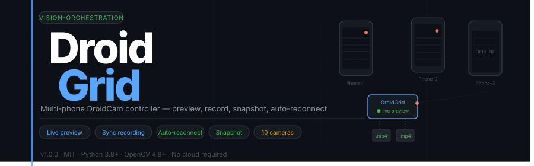

<p align="right">
  <a href="https://github.com/Vision-Orchestration/FERN"></a>
</p>

[](https://python.org)
[](https://opencv.org)
[]()
[](LICENSE)
[](https://github.com/Vision-Orchestration/DroidGrid/releases/tag/v1.0.0)

---

## What is DroidGrid?

Turn any number of Android phones running **DroidCam** into a synchronized multi-camera studio — preview, record, and snapshot from a single Python script.

No external server. No cloud. No subscriptions. Just phones, Wi-Fi, and Python.

> **Context** — DroidGrid was built as the data-collection rig for [FERN ↗](https://github.com/Vision-Orchestration/FERN), a real-time foot gesture recognition system. The naming pattern (`{label}_{person}_{repeat}_{camera}`) maps directly to FERN's training pipeline.

---

## Features

| | Feature | Detail |
|:--|:--------|:-------|
| 📺 | **Live grid preview** | Up to 10 phones in a tiled layout |
| 🎬 | **Simultaneous recording** | Each camera writes its own `.mp4` independently |
| 📷 | **Snapshot** `T` | One JPEG per camera, saved instantly |
| 🔁 | **Self-healing streams** | Frozen-frame detection via MD5 hash + auto-reconnect |
| ⚡ | **Non-blocking I/O** | Dedicated write-queue thread per camera |
| 🏷️ | **Inline session editor** | Change label/person/repeat inside the preview window |
| 📝 | **Custom naming pattern** | `{label}` `{person}` `{repeat}` `{camera}` `{date}` `{time}` |
| 📊 | **Live HUD** | Per-cell FPS, frame counter, drop counter, REC badge |

---

## Requirements

**On your PC:**

```bash
pip install opencv-python numpy
```

**On each Android phone:**

- Install [DroidCam](https://play.google.com/store/apps/details?id=com.dev47apps.droidcam) (free)
- Connect to the same Wi-Fi as your PC
- Open DroidCam — the IP address appears on screen

---

## Quick Start

### 1 — Clone

```bash
git clone https://github.com/Vision-Orchestration/DroidGrid.git
cd DroidGrid
pip install -r requirements.txt
```

### 2 — Configure cameras

Edit the `CAMERAS` list at the top of `droidgrid.py`:

```python
CAMERAS = [
    {"name": "Phone-1", "ip": "192.168.1.101", "port": 4747, "res": (1280, 720), "fps": 30},
    {"name": "Phone-2", "ip": "192.168.1.102", "port": 4747, "res": (1280, 720), "fps": 30},
    {"name": "Phone-3", "ip": "192.168.1.103", "port": 4747, "res": (1280, 720), "fps": 30},
    # add more as needed
]
```

> **Performance tip:** For 5+ cameras, use `"fps": 20` and `"res": (960, 540)`.

### 3 — Run

```bash
python droidgrid.py
```

The preview window opens immediately. Connected cameras appear in the grid; offline ones show a placeholder and reconnect automatically.

---

## Keyboard Controls

| Key | Action |
|:---:|:-------|
| `R` | Start recording on all connected cameras |
| `S` | Stop recording — files saved, repeat counter advances |
| `T` | Snapshot — one JPEG per camera → `snapshots/` |
| `G` | Set session label |
| `P` | Set person ID |
| `N` | Set repeat number |
| `C` | Reconnect all cameras |
| `H` | Toggle HUD overlay |
| `Q` | Quit |

All prompts appear **as overlays inside the preview window** — no terminal input needed.

---

## Output Structure

```
DroidGrid/
├── recordings/
│   ├── walk_p01_r01_Phone-1.mp4
│   ├── walk_p01_r01_Phone-2.mp4
│   └── walk_p01_r01_Phone-3.mp4
└── snapshots/
    ├── walk_p01_r01_Phone-1_20260421_143022.jpg
    ├── walk_p01_r01_Phone-2_20260421_143022.jpg
    └── walk_p01_r01_Phone-3_20260421_143022.jpg
```

Files are **never overwritten** — a numeric suffix is appended if a path exists.

### Naming pattern

Set via `NAMING_PATTERN` in `droidgrid.py`:

```python
NAMING_PATTERN = "{label}_{person}_{repeat}_{camera}"
```

Available tokens: `{label}` `{person}` `{repeat}` `{camera}` `{date}` `{time}`

---

## Architecture

```
Main thread ─── UI rendering loop (30 fps display)
│
├── Camera-1 ──► Capture thread ──► Frame queue ──► Writer thread ──► .mp4
├── Camera-2 ──► Capture thread ──► Frame queue ──► Writer thread ──► .mp4
├── Camera-3 ──► Capture thread ──► Frame queue ──► Writer thread ──► .mp4
└── ...
```

**Capture thread** — reads frames, detects freezes, reconnects on failure.  
**Writer thread** — drains the queue to disk, completely independent of display.  
**Main thread** — builds the grid and handles keyboard events only; never blocks on I/O.

### Self-healing logic

| Failure mode | Detection | Response |
|:-------------|:----------|:---------|
| Stream drop | `cap.read()` fails 10× | Reconnect after 2 s |
| Frozen stream | MD5 hash identical for 60+ frames | Immediate reconnect |

---

## Configuration Reference

All settings live at the top of `droidgrid.py`:

```python
RECORD_DIR       = "recordings"
SNAPSHOT_DIR     = "snapshots"
NAMING_PATTERN   = "{label}_{person}_{repeat}_{camera}"
CELL_W           = 640      # preview cell width (px)
CELL_H           = 360      # preview cell height (px)
CODEC            = "mp4v"   # fourcc: mp4v / MJPG / XVID
FREEZE_THRESHOLD = 60       # identical frames before reconnect
RECONNECT_DELAY  = 2.0      # seconds between reconnect attempts
```

---

## Troubleshooting

**Camera shows OFFLINE immediately**
- Confirm the IP in `CAMERAS` matches the one shown in the DroidCam app
- Confirm both devices are on the same Wi-Fi (not a guest network)
- Check that Windows Firewall / antivirus isn't blocking port `4747`
- Verify the stream works: open `http://<phone-ip>:4747/mjpegfeed` in a browser

**Frames are dropping / stream is laggy**
- Switch to a 5 GHz Wi-Fi network
- Lower `fps` to `20` and `res` to `(960, 540)` per camera
- Reduce `CELL_W` / `CELL_H`

**Video files are empty or won't open**
- Change `CODEC` from `"mp4v"` to `"MJPG"` and use a `.avi` extension
- Check disk space

---

## FAQ

**Does it work with RTSP cameras (not just DroidCam)?**  
Yes. Set `"ip"` to the full RTSP URL, `"port"` to `None`, and adjust the `url` property in the `Camera` class to return `self.ip` directly.

**DroidCam free vs paid — which do I need?**  
Free works fully. Paid removes the watermark and unlocks higher resolutions.

**How many phones can I use at once?**  
Tested up to 5 phones at 1280×720 / 30 fps on mid-range hardware. For 10 phones, use 960×540 at 20 fps.

**Can I use this for research / dataset collection?**  
Yes — that's exactly what it was built for. The naming pattern maps directly to [FERN's](https://github.com/Vision-Orchestration/FERN) training pipeline.

---

## Repository Structure

```
DroidGrid/
├── assets/
│   └── banner.svg
├── droidgrid.py        # single-file application
├── requirements.txt
├── CHANGELOG.md
├── LICENSE
└── README.md
```

---

## Related Projects

| Project | Description |
|:--------|:------------|
| [**FERN**](https://github.com/Vision-Orchestration/FERN) | Foot gEsture Recognition Network — the ML system DroidGrid was built to feed. Real-time gesture classification via MediaPipe + CNN-BiLSTM-Attention. |

---

## Contributing

Issues and pull requests are welcome.

```bash
git checkout -b feature/my-feature
# make changes
git commit -m "feat: describe your change"
# open a pull request
```

---

## Changelog

See [CHANGELOG.md](CHANGELOG.md).

---

## License

Released under the [MIT License](LICENSE) — free for personal, academic, and commercial use.

---

<sub>Part of the [Vision-Orchestration](https://github.com/Vision-Orchestration) toolkit. Built with OpenCV. No cloud. No subscriptions. Just cameras.</sub>
